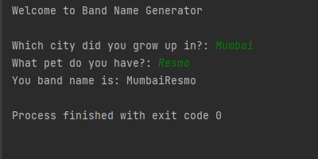

# A Very Simple Input Output Project.

## Doing this project helped me understand:-
1. The Syntax of Python.
2. How to Print Something to the Console.
3. How to Take input from the User.
4. Concept of Variables in Python.
5. String Concatenation.